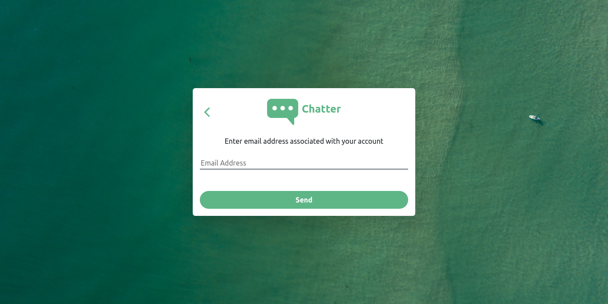
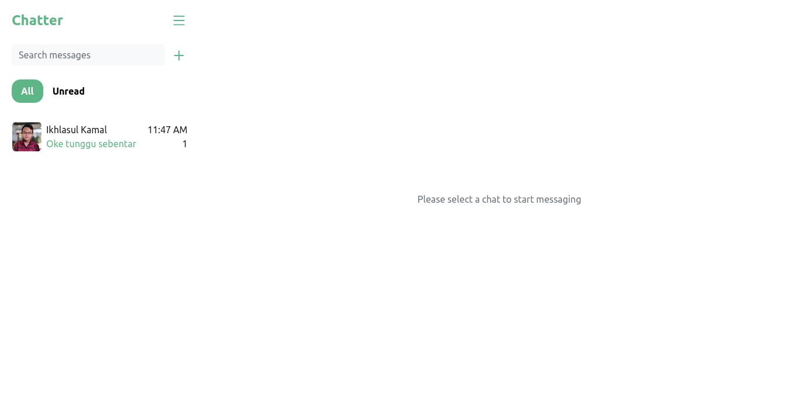

<br />
<p align="center">
  <div align="center">
    
  </div>
  <h3 align="center">Chatter (Messaging App)</h3>
  <p align="center">
    <a href="https://github.com/alifankebima/chatter-frontend"><strong>Explore the docs »</strong></a>
    <br />
    <a href="https://chatter-frontend.vercel.app">View Demo</a>
    ·
    <a href="https://chatter-backend-production.up.railway.app">Api Demo</a>
  </p>
</p>

## Table of Contents

- [Table of Contents](#table-of-contents)
- [About The Project](#about-the-project)
  - [Built With](#built-with)
- [Getting Started](#getting-started)
  - [Prerequisite](#prerequisites)
  - [Installation](#installation)
- [Screenshots](#screenshots)
- [Related Project](#related-project)

# About The Project

Chatter is a website for communicating online and in real-time. Users can create an account, change profile information, and communicate with others in text form.

## Built With

These are the libraries used for building this frontend

- [React](https://reactjs.org/)
- [Bootstrap](https://getbootstrap.com/)
- [React-icons](https://react-icons.github.io/react-icons/)
- [Sweetalert2](https://sweetalert2.github.io)
- [Axios](https://axios-http.com)
- [Socket.io](https://socket.io)
- [Redux](https://redux.js.org)

# Getting Started

## Prerequisites

You'll need these programs installed before proceeding to installation

- [Git](https://git-scm.com/downloads)
- [Node.js](https://nodejs.org/en/download)

This project requires [chatter-backend](https://github.com/alifankebima/chatter-backend) to function properly, follow the steps provided in the readme to install and run the backend API

## Installation

Follow this steps to run the server locally

1. Clone this repository

```sh
git clone https://github.com/alifankebima/chatter-frontend.git
```

2. Change directory to chatter-frontend

```sh
cd chatter-frontend
```

3. Install all of the required modules

```sh
npm install
```

4. Create and configure `.env` file in the root directory, example env are provided in [.env.example](./.env.example)

```env
REACT_APP_API_URL=[ Backend URL ]
```

5. Run this command to run the server

```sh
npm start
```

- Run this command to build this website into production ready

```sh
npm build
```

# Screenshots

<table>
  <tr>
    <td></td>
    <td></td>
  </tr>
   <tr>
    <td>Login</td>
    <td>Register</td>
  </tr>
  <tr>
    <td></td>
    <td></td>
  </tr>
   <tr>
    <td>Email Activation</td>
    <td>Forgot Password</td>
  </tr>
   <tr>
    <td></td>
    <td> </td>
  </tr>
   <tr>
    <td>Home Page</td>
    <td>Menu</td>
  </tr>
    <tr>
    <td></td>
    <td> </td>
  </tr>
   <tr>
    <td>Private Message</td>
    <td>Edit Profile</td>
  </tr>
</table>

# Related Project

:rocket: [`Frontend Chatter`](https://github.com/alifankebima/chatter-frontend)

:rocket: [`Backend Chatter`](https://github.com/alifankebima/chatter-backend)

:rocket: [`Demo Chatter`](https://chatter-frontend.vercel.app)
